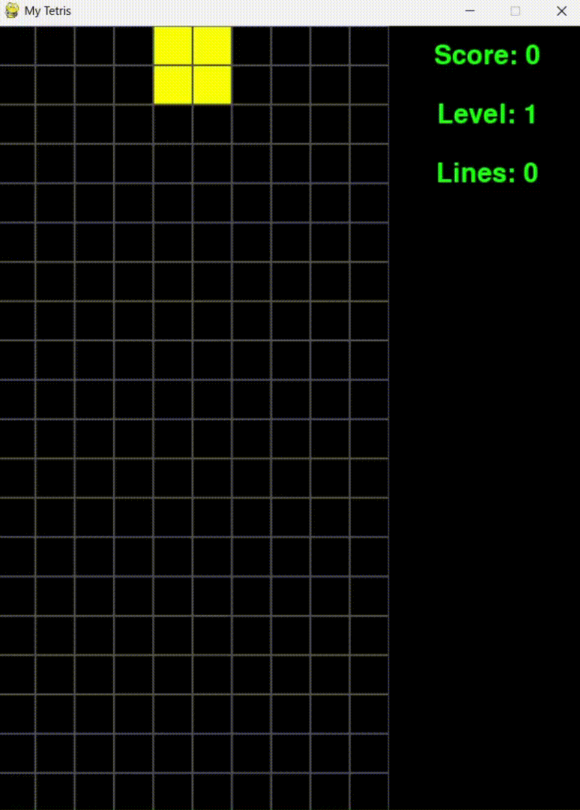
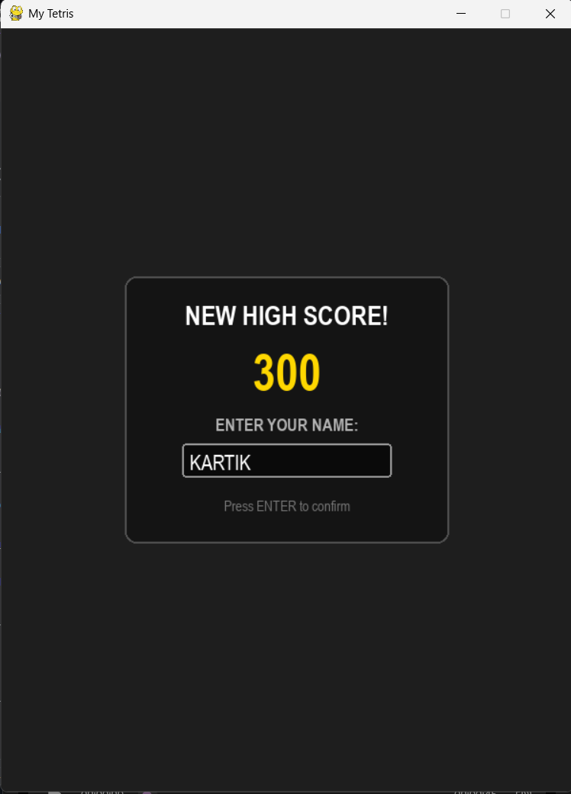
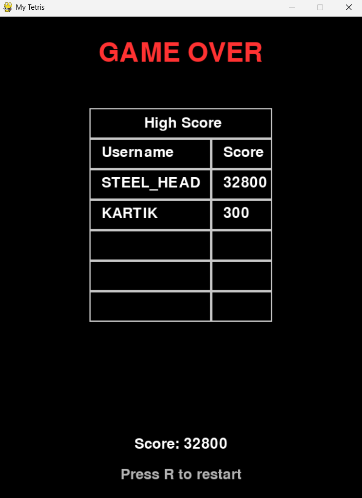

# 🧩 Tetris Clone in Python

<div align="center">

### A modern Tetris implementation built with Python and Pygame

🎮 Classic gameplay • 🏆 Persistent Leaderboard • 📈 Level Progression • 💾 SQLite Database

</div>

---

## 📸 Screenshots

### Gameplay



### High Score



### Leaderboard



---

## ✨ Features

### 🎮 Core Gameplay

* Classic Tetris mechanics
* Seven Tetromino block types
* Smooth block movement
* Block rotation system
* Collision detection
* Automatic piece spawning
* Game Over detection

### 📈 Progression System

* Score tracking
* Level system
* Increasing difficulty as levels increase
* Line clearing mechanics

### 🏆 Leaderboard System

* SQLite-powered persistent leaderboard
* Username-based score tracking
* High score storage across game sessions
* Top scores displayed in-game

### ⌨️ Controls

* Move Left
* Move Right
* Soft Drop
* Hard Drop
* Rotate Piece

---

## 🛠️ Technologies Used

| Technology                  | Purpose                   |
| --------------------------- | ------------------------- |
| Python                      | Core programming language |
| Pygame                      | Game engine and rendering |
| SQLite3                     | Local database storage    |
| Object-Oriented Programming | Game architecture         |
| Git & GitHub                | Version control           |

---

## 📂 Project Structure

```text
Tetris/
│── game.db
├── screenshots/
├── main.py
├── my_db.py
└── README.md

---

## 🚀 Installation

### Clone the Repository

```bash
git clone https://github.com/kartik815/Tetris_fun_game.git
```

### Navigate to the Project

```bash
cd Tetris_fun_game
```

### Install Dependencies

```bash
pip install pygame
```

### Run the Game

```bash
python main.py
```

---

## 🎯 How to Play

The objective is simple:

1. Arrange falling Tetrominoes.
2. Complete horizontal lines.
3. Earn points by clearing lines.
4. Level up as your score increases.
5. Survive as long as possible and reach the leaderboard!

---

## 🏆 Scoring System

| Action            | Points             |
| ----------------- | ------------------ |
| Single Line Clear | 100                |
| Double Line Clear | 300                |
| Triple Line Clear | 500                |
| Tetris (4 Lines)  | 800                |

---

## 🗄️ Database

The game uses SQLite3 for persistent storage.

Stored information includes:

* Username
* High Score
* Leaderboard Rankings

Database file:

```text
game.db
```

---

## 🔮 Planned Features

* [ ] Pause Menu
* [ ] Hold Piece System
* [ ] Next Piece Preview
* [ ] Sound Effects
* [ ] Background Music
* [ ] Settings Menu
* [ ] Themes and Skins
* [ ] Online Leaderboards
* [ ] Fullscreen Support
* [ ] Ghost Piece Indicator

---

## 📈 Future Improvements

The project is actively being improved and serves as a learning journey in:

* Game Development
* Object-Oriented Programming
* Database Integration
* Software Design
* User Interface Development

---

## 🤝 Contributing

Contributions, suggestions, and improvements are welcome.

Feel free to:

* Fork the repository
* Create a new branch
* Submit a pull request

---

## 📜 License

This project is intended for educational and learning purposes.

---

<div align="center">

### ⭐ If you enjoyed this project, consider starring the repository!

Made with ❤️ using Python and Pygame

</div>
